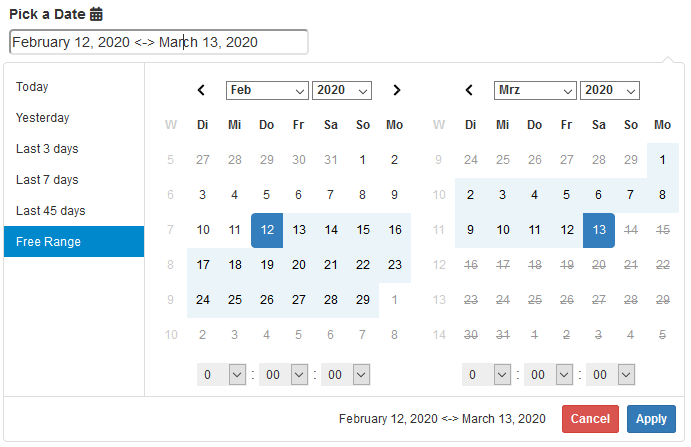

# daterangepicker

<p align="center">
  
</p>

<!-- badges: start -->
[](https://www.tidyverse.org/lifecycle/#maturing)
[](https://travis-ci.org/trafficonese/daterangepicker)
[](https://codecov.io/gh/trafficonese/daterangepicker?branch=master)
<!-- badges: end -->

Custom Shiny input binding for a [Date Range Picker](https://www.daterangepicker.com/).

## Installation

``` r
# install.packages("remotes")
remotes::install_github("trafficones/daterangepicker")
```

## Example

A basic example of a Date Range Picker:

``` r
library(shiny)
library(daterangepicker)

## UI ##########################
ui <- fluidPage(
  daterangepicker(
    inputId = "daterange",
    label = "Pick a Date",
    start = Sys.Date() - 30, end = Sys.Date(),
    style = "width:100%; border-radius:4px",
    icon = icon("calendar")
  ),
  verbatimTextOutput("print"),
  actionButton("act", "Update Daterangepicker"),
)

## SERVER ##########################
server <- function(input, output, session) {
  output$print <- renderPrint({
    req(input$daterange)
    input$daterange
  })
  observeEvent(input$act, {
    updateDaterangepicker(session, "daterange",
                          start = Sys.Date(), 
                          end = Sys.Date() - 100)
  })
}

shinyApp(ui, server)
```

